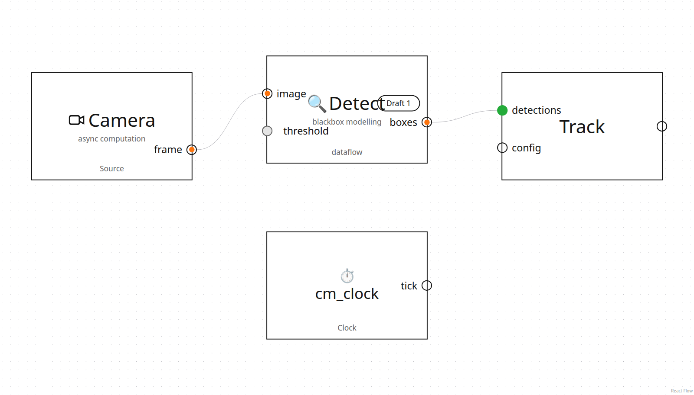
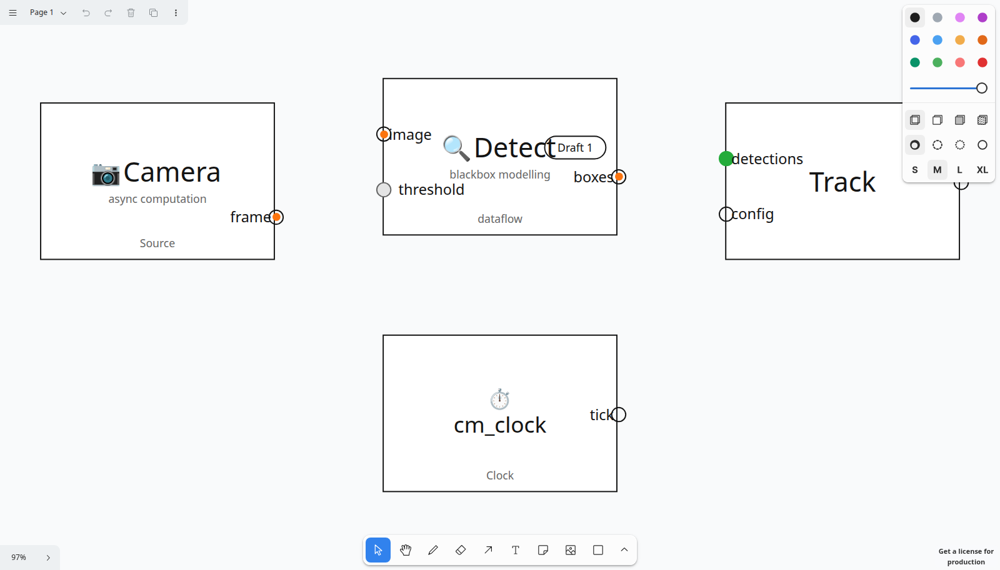

# bbox-ui

A shadcn-style component registry of **presentational** components for
black-box system design — blocks, ports, and (later) edges and regions.
Extends the idea of [React Flow UI](https://reactflow.dev/ui): copy-paste
components you own, not a library you depend on.

v1 ships exactly two components, built from the `bbox-ui-v2.systemsketch`
wireframe: **`Port`** and **`Block` (Simple View)**.

Both demos, same components, two hosts:

| React Flow (`demos/reactflow`) | tldraw (`demos/tldraw`) |
|---|---|
|  |  |

## Components

### Port

A circle with a text slot — the component does not define what goes in the
slot.

- **States**: `empty` (hollow ring) · `default` ("Default Value", filled
  neutral) · `wired` (accent dot inside the ring) · `received` ("Data
  Recived" on the board). `received` is a **runtime** prop, never persisted
  document state.
- **Text layout**: `top` · `bot` · `right` · `left` · `right-offset` ·
  `left-offset` — where the slot sits relative to the dot; offset variants
  sit the label further out for a dot hanging outside the block edge.
- **Text size**: `md` 24 / `lg` 36 / `xl` 44 (the board's h3/h2/h1 rungs).
- **Diameter**: `sm` 14 / `md` 25 / `lg` 36.

```tsx
<Port state="wired" size="md" textLayout="right">image</Port>
```

### Block — Simple View

Anatomy (the API vocabulary): **Container** (`Block`), **Header band**
(`BlockHeader`), **Glyph** (`BlockGlyph`), **Text slots** (`BlockTitle`,
`BlockDescription`, `BlockType`), **Chip** (`BlockChip`).

The Glyph and Title always go next to each other, and the glyph resizes with
the title rung at **0.9 ×** the title font size (44→40, 36→32, 24→22).

```tsx
<Block>
  <BlockHeader>
    <BlockGlyph>🔍</BlockGlyph>
    <BlockTitle>Detect</BlockTitle>
    <BlockChip>Draft 1</BlockChip>
  </BlockHeader>
  <BlockDescription>blackbox modelling</BlockDescription>
  <BlockType>dataflow</BlockType>
</Block>
```

## One core, two hosts — the adapter diff

The presentational core never imports a canvas engine. Each host wraps the
same JSX; the only lines that differ are the host's own concerns
(highlighted):

<table>
<tr><th>React Flow node</th><th>tldraw ShapeUtil</th></tr>
<tr><td>

```tsx
export function BBoxBlockNode(
  { data }: NodeProps<BBoxBlockNodeType>,   // ← host seam
) {
  return (
    <Block>                                  {/* same core */}
      <BlockHeader>
        <BlockGlyph>{data.icon}</BlockGlyph>
        <BlockTitle>{data.title}</BlockTitle>
      </BlockHeader>
      <BlockType>{data.blockType}</BlockType>
      {data.ports.map((p) => (
        <Handle                              // ← port is a DOM element
          id={p.id}
          position={Position.Left}
          className={portDotClass(p.state)}
          style={{ top: `${p.t * 100}%` }}
        />
      ))}
    </Block>
  );
}
// size: React Flow measures the DOM
// into node.measured.width/height
```

</td><td>

```tsx
class BBoxBlockShapeUtil
  extends ShapeUtil<BBoxBlockShape> {        // ← host seam
  getGeometry(s) {                           // ← size is computed,
    return new Rectangle2d({                 //   props.w/h authoritative
      width: s.props.w, height: s.props.h,
      isFilled: true });
  }
  component({ props }) {
    return (
      <HTMLContainer>
        <Block width={props.w} height={props.h}> {/* same core */}
          <BlockHeader>
            <BlockGlyph>{props.icon}</BlockGlyph>
            <BlockTitle>{props.title}</BlockTitle>
          </BlockHeader>
          <BlockType>{props.blockType}</BlockType>
          {props.ports.map((p) => {
            const a = portAnchor(p.side, p.t,
              props.w, props.h);             // ← port is a geometry point
            return <PortDot state={p.state}
              style={{ left: a.x, top: a.y }} />;
          })}
        </Block>
      </HTMLContainer>
    );
  }
}
```

</td></tr>
</table>

The full line is drawn in [ARCHITECTURE.md](ARCHITECTURE.md): layout geometry
is portable and lives in the core; interaction geometry (hit-testing,
snapping, z-order, drag) is host-owned and never travels.

## Registry

`registry.json` follows the
[shadcn registry schema](https://ui.shadcn.com/docs/registry/registry-json);
`pnpm registry:build` (shadcn `build`) emits servable items to `public/r/`:
`port`, `block`, `bbox-layout`, `block-node-reactflow`, `block-shape-tldraw`.

## Develop

```bash
pnpm install
pnpm test              # layout unit tests (icon ratio, states, layouts)
pnpm build             # typecheck everything + build both demos
pnpm demo:reactflow    # http://127.0.0.1:5183
pnpm demo:tldraw       # http://127.0.0.1:5189
node demos/drive.mjs reactflow http://127.0.0.1:5183   # headless assert + screenshot
node demos/drive.mjs tldraw    http://127.0.0.1:5189
```

> **tldraw licence note**: tldraw's SDK licence forbids production use
> without a paid licence. The pinned `tldraw@5.3.2` here is for local
> development only — do not ship the tldraw adapter in a product without
> resolving licensing.
